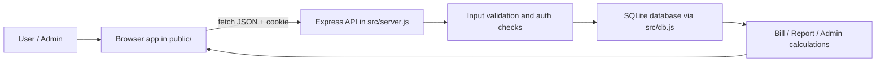

# Architecture

## System overview

DailyDrop is a single-process web application with a static browser client and a Node.js/Express API backed by SQLite. The browser uses same-origin JSON requests and an HttpOnly session cookie, while the server owns authentication, validation, billing logic, and persistence.

## Project structure

- `public/`: static frontend assets (`index.html`, `styles.css`, `app.js`)
- `src/server.js`: HTTP middleware, route handling, validation, session logic, billing/reporting endpoints
- `src/db.js`: SQLite initialization, schema setup, migrations, and prepared statements
- `data/`: runtime SQLite files and WAL state
- `test/`: integration tests for API behavior and security boundaries
- `server.js` / `db.js`: compatibility entrypoints that re-export the source modules for the existing startup flow

## Request flow

### 1. App bootstrap

When the app starts:

- the project entrypoint loads `src/server.js`
- Express creates the app and configures trust-proxy and security headers
- SQLite is opened and schema/migration setup runs in `src/db.js`
- the server binds to the configured port and begins listening

### 2. Browser load

The browser loads `public/index.html`, which mounts the app shell and renders the UI using `public/app.js`.

The frontend reads and writes data through same-origin endpoints such as:

- `/api/auth/login`
- `/api/products`
- `/api/entries/:date/:productId`
- `/api/payments/:month`
- `/api/reports/monthly-totals`
- `/api/admin/bills`

### 3. Authentication flow

User sessions are managed with a signed, HttpOnly cookie and a server-side token hash stored in `sessions`.

- login validates the username/password with a per-user salt and scrypt hash
- a session token is generated and saved as a SHA-256 hash
- the cookie is set with `HttpOnly`, `SameSite=Lax`, and `Secure` in production
- protected endpoints call `requireAuth`, which resolves the session and attaches the authenticated user to the request

### 4. Product and delivery flow

Products are authored by a user with:

- name
- unit price
- default quantity
- schedule type and config

Delivery entries store:

- user ID
- product ID
- delivery date
- quantity
- immutable product name snapshot
- immutable unit-price snapshot
- update timestamp

This snapshot pattern prevents historical bills from changing if a product is later edited or removed.

### 5. Billing and reporting flow

Bills are derived from entries with quantity greater than zero and use the stored unit-price snapshot at the time the delivery was recorded.

Key rules:

- missed delivery entries are represented with quantity `0` and contribute no amount
- monthly totals sum positive quantities multiplied by the stored historical unit price
- payment records are compared against the current bill to determine `paid`, `partial`, `pending`, or `no-bill`
- reports aggregate monthly totals for a rolling window and summarize product totals for the selected month

## Data model

### `users`

Stores account identity and profile metadata, including:

- username
- password hash and salt
- profile fields
- admin flag
- created timestamp

### `sessions`

Stores a hashed session token, the owning user, and expiry time. Session cookies are never stored in clear text on the client.

### `products`

Stores the user catalog and delivery schedule metadata:

- name
- price
- default quantity
- schedule type
- schedule JSON config

### `entries`

Stores delivery history and immutably preserves what was purchased at the time it was recorded:

- product ID
- delivery date
- quantity
- product name snapshot
- unit price snapshot
- updated timestamp

The product ID is intentionally not kept as a foreign key for historical integrity, so deleting a product does not delete or rewrite prior entries.

### `payments`

Stores one payment record per user per month:

- user id
- payment month
- amount
- method
- optional note
- updated-by user
- updated timestamp

## Security and validation boundaries

The server applies protections at the request boundary:

- strict content security policy
- no-sniff and framing headers
- JSON body limits
- per-IP rate limiting on registration and login
- generic login failures to avoid user enumeration
- session checks on authenticated routes
- admin-only checks on `/api/admin/*` endpoints
- parameter validation before database writes
- prepared statements for all SQL execution

User-supplied strings are not rendered as HTML; they are passed through DOM text APIs in the client.

## Operational notes

- SQLite files live under `data/` by default and should be on persistent storage in production
- Node’s built-in `node:sqlite` module is used, so no native dependency installation is required
- the app is intentionally static and build-free; deployment is a Node service with a persistent database volume
- `npm test` exercises the integration flow against an isolated temporary database and verifies the billing/security contract

## Summary

The architecture is intentionally simple and explicit:

- browser renders the interface and calls the API
- Express routes validate and authorize requests
- SQLite holds users, schedules, delivery history, and payments
- historical snapshots ensure bills remain consistent over time
- the app preserves a clear separation between user-facing behavior and database-backed accounting logic